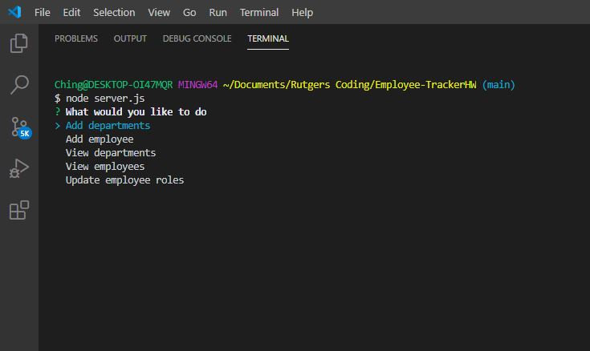
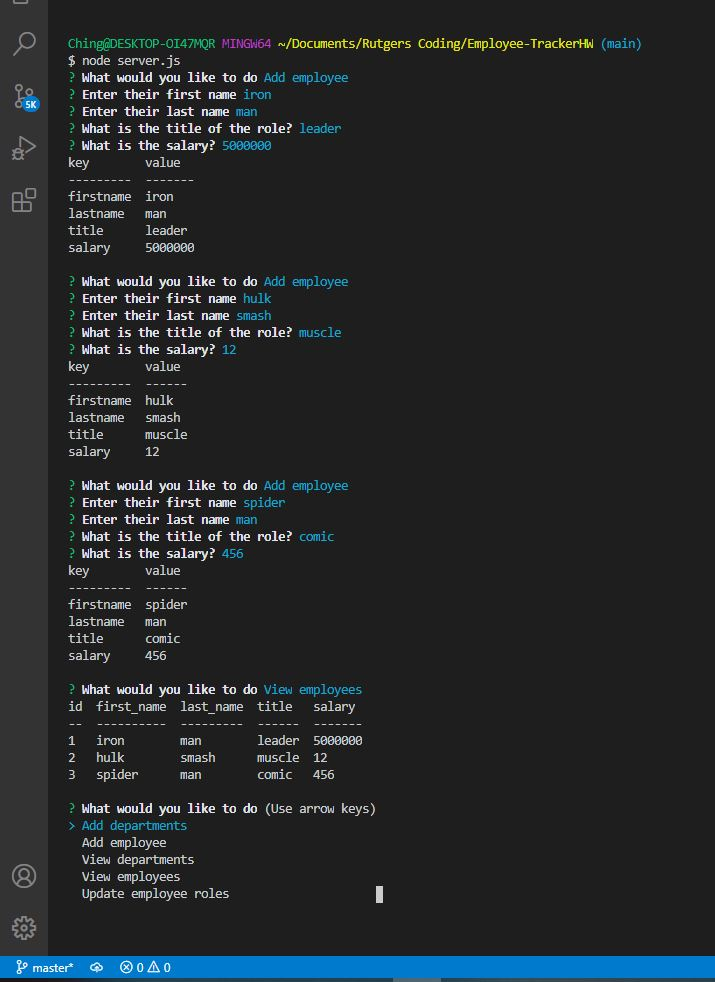
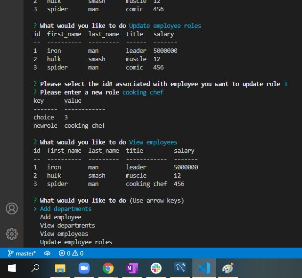

# Employee-Tracker
Developers are often tasked with creating interfaces that make it easy for non-developers to view and interact with information stored in databases. Often these interfaces are known as Content Management Systems. In this homework assignment, your challenge is to architect and build a solution for managing a company's employees using node, inquirer, and MySQL.

## Installation
---
1. Run `npm install` to install all dependencies
2. Run `schema.sql` in MySQLWorkbench
3. Run node server.js in VSS under the

## Usage
---
1. Run `node server.js` to fire up the application
2. Select from the menu to view, add, remove, or update employees, roles, departments

    

3. Add employees/ departments, then follow prompts

    
    
4. Update Employee roles as desired 

    

## Tools Used / Dependancies
---
* node.js
* mysql workbench
* inquirer
* console.table 

## Links 
---
* https://drive.google.com/file/d/10YPJtxfs4XosUsk7mtyIWjTCdpR_ptu7/view
* https://github.com/brc9087/Employee-TrackerHW

